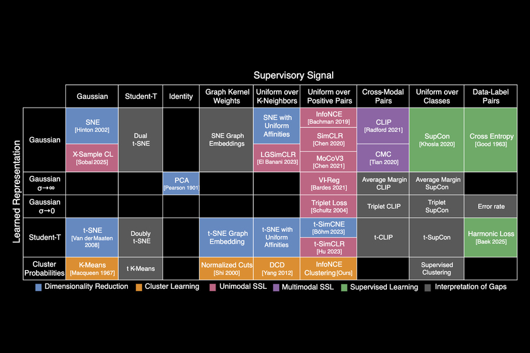



## [License & Citation](index.md#license)

# AI/ML Algorithm

Effect of AI/ML algorithm on computing and networking architecture

## AI/ML Algorithm Progress

### A MIT Review [[MIT](https://www.csail.mit.edu/news/periodic-table-machine-learning-could-fuel-ai-discovery)]

MIT researchers have created a periodic table that shows how more than 20 classical machine-learning algorithms are connected.

