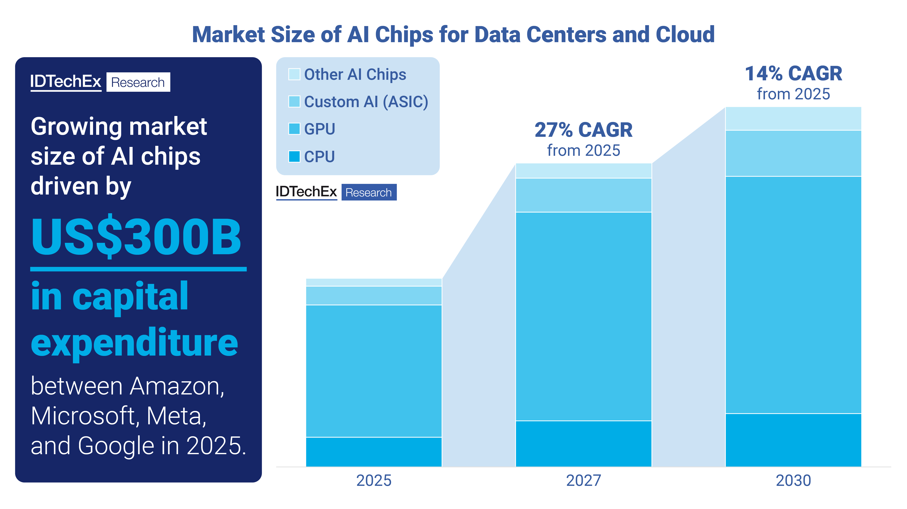



## [License & Citation](index.md#license)

# AI Chips

## Products

### Incumbents

- NVIDIA GPU: Hopper, Blackwell, Rubin
- AMD GPU: MI300 Series
- Intel NPU: Gaudi
- Huawei NPU: Ascend 910
- Qualcomm NPU: Cloud AI 100

### Start-ups

- Cerebras
- Groq
- Graphcore
- SambaNova
- Untether AI

## Market Research

AI Chips for Data Center and Cloud to Exceed US$400 Billion by 2030

Author: Jameel Rogers, Technology Analyst at IDTechEx [[link](https://www.idtechex.com/emails/17794)]

    IDTechEx forecasts that the AI Chips market will reach US$453 billion by 2030 at a CAGR of 14% between 2025 and 2030.

AI Chips Market by AI Chip Type. For full data, refer to "AI Chips for Data Centers and Cloud 2025-2035: Technologies, Market, Forecasts". Source: IDTechEx

