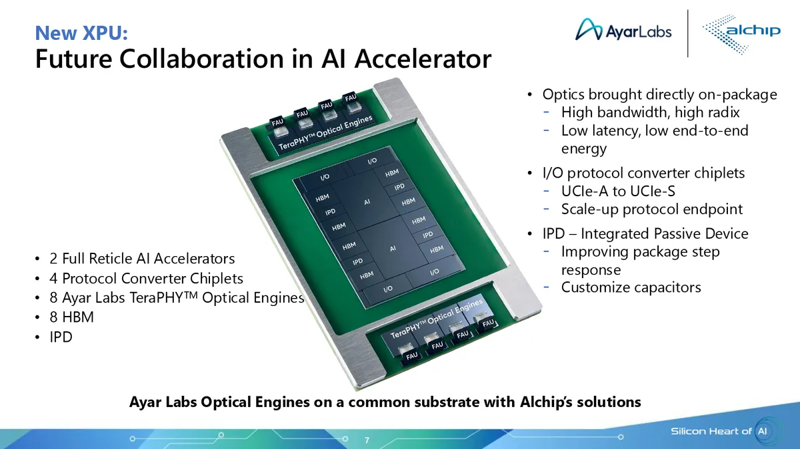



# Ayar Labs CPO

---

 

## Update

 

**TSMC's European OIP** (*Dec 2025*)
- Partnership with Alchip
- three-chiplet co-packaged optical I/O subsystem
    - Alchip UCIe-A to UCIe-S protocol-converter: terminates the accelerator's UCIe-A interface and implements scale-up protocols (UALink, PCIe, Ethernet, SUE) over UCIe-S (streaming)
    - Alchip EIC: SerDes, modulation drivers, clocking, and control
    - Ayar Labs TeraPHY PIC: optical modulation and detection
- PIC
    - 8x OE per accelerator (reference design)
    - microring architecture
    - detachable fiber connectors
    - option1: PAM4 CWDM (100–200 ns per hop, BER < 10⁻⁶) 
    - option2: DWDM fast-follower (20–30 ns per hop, BER < 10⁻¹²)
- Accelerator reference design
    - 100+ Tb/s of bandwidth: 16Tbps per OE
    - 256+ optical ports: 16-fiber per OE

mockup reference design

Ref:
- [tomsHW](https://www.tomshardware.com/tech-industry/semiconductors/industrys-first-tsmc-coupe-based-optical-connectivity-solution-for-next-gen-ai-chips-displayed-alchip-and-ayar-labs-show-future-silicon-photonics-device?utm_content=361094538&utm_medium=social&utm_source=linkedin&hss_channel=lcp-6627049)

 

 