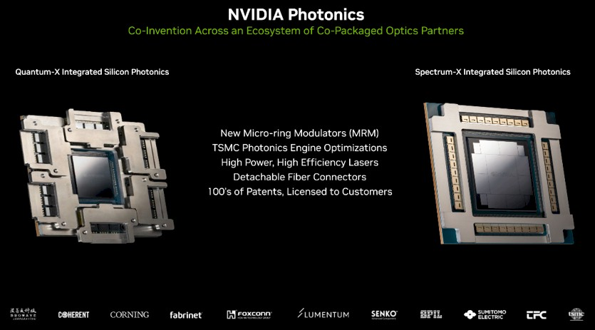



## [License & Citation](index.md#license)

# Co-Packge Optics (CPO)

## Different CPO implementations

### NVIDIA

The follow analysis is based on GTC 2025 keynote presented by Jensen Huang.

<!--  -->

#### Quantum-X InfiniBand Switch ASIC with CPO 

Plan to ship in 2025H2

**Features**
- 6 CPO socket per GPU (B200/B300?), closer to a NPO concept
- 3 optical engines in each socket
- SerDes running at 224Gb/s per lane with 24Gb as error correction overhead thus 200Gb/s net data rate
- SerDes per ASIC have 72 lanes
- liquid cooling for both the switch core and all optical modules
- 28.8Tbps full duplex bandwidth per switch
- 6 optical subassembly integrated on the switch package’s interposer
- 4.8Tbps of transmit and 4.8Tbps of receive per optical subassembly
- 3 optical engines per optical subassembly

**Q3450 System**
- 4 Quantum-X chips—provides 115.2Tbps full-duplex bandwidth over 144 ports with 800Gbps

An in-depth analysis is here: [NVIDIA Quantum-X CPO](nv_quantumx_cpo.md)

#### Spectrum-X Ethernet Switch ASIC with CPO (GTC 2025 Keynote)

Plan to ship in 2026H2

**Features**
- multi-chip module package 
- the Ethernet switch ASIC has a monolithic packet processing engine 
- 8 SerDes chiplets (two per side) 
- 4 unknown chiplets at the corners
- 8 optical engines on each side, i.g. a total of 32 OEs
- each optical engine may  support at least 1.6Tb/s (equal to the optical engine in Quantum-X)
- same 200Gb/s SerDes, 144 lanes pre ASIC
- liquid cooled

 

#### Interconnect Design

Power savings compared to pluggable transeivers
- Pluggable: 30W \@ 1.6Tb/s, i.e. **18.75 pJ/bit**
- CPO: 9W \@ 1.6Tb/s, i.e. **5.625 pJ/bit** (the optical engine exclude CW laser is **4.375 pJ/bit** *)

\* CW laser power consumption estimation: assuming 12mW is fed to each modulator channel, i.e. 80mW for 8 channels. At least two optical coupling in the link which introduces ~5dB loss, i.e. ~300mW laser output power is required. Assuming the wall-plug efficiency of the laser is ~15% (uncooled at 55C), the laser power is ~2W. Assuming the laser is uncooled and the laser driver has a ~60% conversion efficiency, the overall power of is ~3W, i.e.g ~2 pJ/bit for 1.6Tb/s.

#### Optical Engine

Ref: 
[NVidia Blog](https://developer.nvidia.com/blog/how-industry-collaboration-fosters-nvidia-co-packaged-optics/)

**OE for Quantum-X**
- 1.6Tbps PAM4 per OE
- 8 Tx and 8 Rx 200Gbps PAM4 channels, 2 laser input fibers per optical engine
- 200Gbps PAM4 microring modulator per wavelength
- multi-row scaling of optical interconnect throughput within a single package
- Stacked CMOS and photonics components 
- Wafer-level integration of micro-lenses

**OE for Spectrum-X**
- 3.2Tbps PAM4 per OE
- 16 Tx and 16 Rx 200Gbps PAM4 channels, ? laser input fibers per OE
- 200Gbps PAM4 microring modulator per wavelength
- solder reflown directly onto the module substrate
- Stacked CMOS and photonics components 
- Wafer-level integration of micro-lenses
- detachable optical connector 

**Challegnes Solved by TSMC**
- precise control of the fabrication process
- mitigation of thermal sensitivity
- consistent high-speed modulation

 

#### External Laser

Ref: 
[NVidia Blog](https://developer.nvidia.com/blog/how-industry-collaboration-fosters-nvidia-co-packaged-optics/)

**Features**
- 8 lasers per ELS module
- Quantum-X switch
    - 1ELS -> 8 lasers -> 32 lanes: 1 laser per 4-lane
    - 4.5 ELS modules per ASIC
    - 18 ELS per System (4 ASIC)
- Spectrum-X Switch
    - 16 ELS modules per ASIC
    - 64 ELS modules per system (4 ASIC)

**Challenges Solved**
- own dedicated, thermally controlled environment addresses repeated thermal cycling rapidly degrades laser lifetime
- reducing the total number of lasers in the data center by a factor of four compared to legacy designs
    - implies 1 laser per 4 modulators (compared with EML), however, the same as the design for Si photonics based modules

 

---

## Technical Designs

 

### Optical Fiber Coupling

#### Senko

Senko develops detachable fiber connector for PIC coupling for CPO applications

Key features
- Curved micro-refector for focusing light into PIC couplers
- Variations for PIC surface (grating) and edge coupling
- Detachable

Ref
- [Lightwaveonline](https://www.lightwaveonline.com/optical-tech/components/article/14289297/senko-advanced-components-inc-metallic-pic-connector)

#### Teramount

Teramount’s TeraVERSE provides a detachable and serviceable fiber mounting socket. 

Key features
- Detachable and serviceable
- Self-aligning installation

Implementation
- Fibers connected to the CPO package after all reflows
- Detachability enables in-field serviceability of faulty fibers
- Wafer-level testability of PIC

Ref
- [Lightwaveonline](https://www.lightwaveonline.com/home/article/14305463/teramount-teraverse)