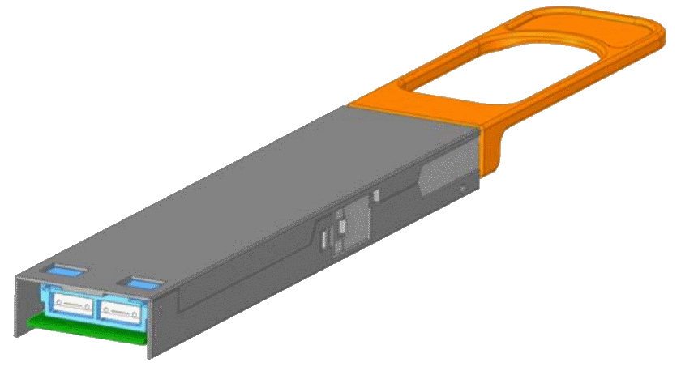
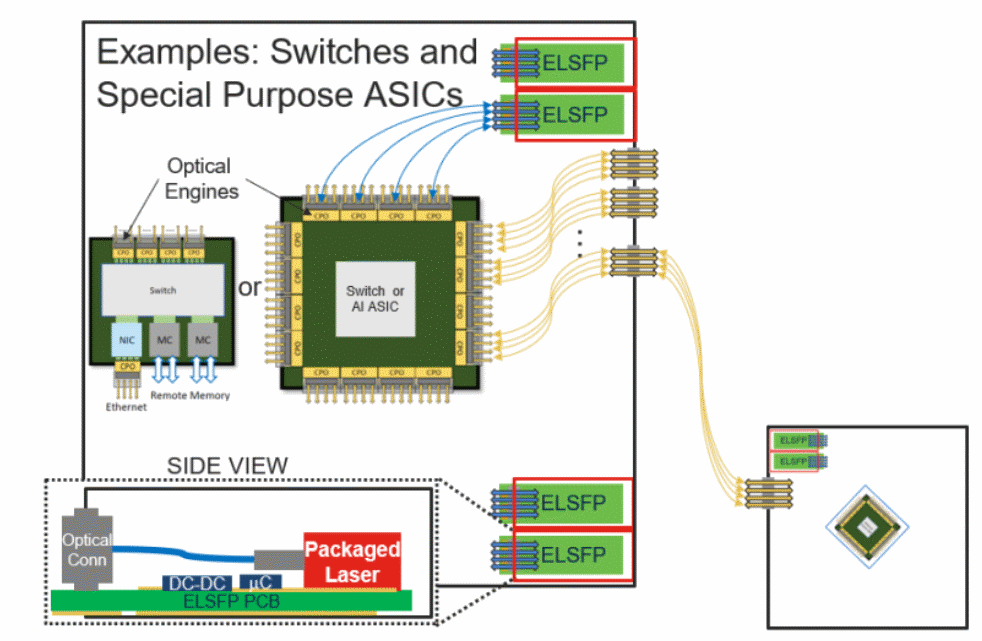
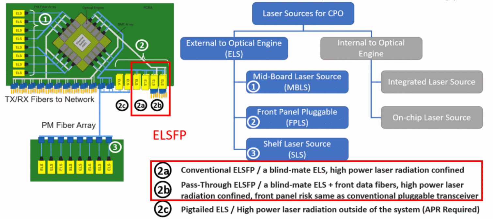



## [License & Citation](index.md#license)

 

# External Light Source for CPO

## Navigation

- [Standards](#standards)
    - [CW-WDM](#cw-wdm)
    - [OIF-ELSFP](#oif-elsfp)
    - [IPEC-PELS](#ipec-pels)
    - [OIF-Co-Packaging-3.2T](#oif-co-packaging-32t)
- [Suppliers](#suppliers)
    - [Accelink](#accelink)
    - [AOI](#aoi)
    - [Broadcom](#broadcom)
    - [Casela](#casela)
    - [Coherent (II-VI)](#coherent-ii-vi)
    - [Furukawa (Fitel)](#furukawa-electric-fitel)
    - [HGTech](#hgtech)
    - [Lumentum](#lumentum)
    - [O-net](#o-net)
    - [Shijia](#shijia)
    - [Terahop (Innolight)](#terahop-innolight)
    - [YuanJie](#yuanjie)

 

## Standards

### CW-WDM

[Website](https://cw-wdm.org/)

*Version: June 4th, 2021*

**Wavelength grid specifications**

Table 2–5 Grid specifications

| Description      | Wavelength span (nm) | Number of channels | Channel spacing (GHz) | Channel bandwidth (GHz) |
|------------------|----------------------|--------------------|------------------------|--------------------------|
| Grid definition  | 9                    | 8+1                | 200                    | 100                      |
|                  | 9                    | 16+1               | 100                    | 50                       |
|                  | 18                   | 8+1                | 400                    | 200                      |
|                  | 18                   | 16+1               | 200                    | 100                      |
|                  | 18                   | 32+1               | 100                    | 50                       |
|                  | 36                   | 8+1                | 800                    | 400                      |
|                  | 36                   | 16+1               | 400                    | 200                      |
|                  | 36                   | 32+1               | 200                    | 100                      |

 

**Maximum output power classes**

| Output power class | 9 nm span  | 18 nm span  | 36 nm span | Units |
|--------------------|----------------------------------|----------------------------------|----------------------------------|--------|
| Type 1             | 20                               | 20                               | 14                               | dBm    |
| Type 2             | 14                               | 14                               | 8                                | dBm    |
| Type 3             | 26                               | 26                               | 20                               | dBm    |

 

### OIF-ELSFP

[Website](https://www.oiforum.com/technical-work/implementation-agreements-ias/)

*Version: 02.0 (January 8, 2025)*

 

**ELSFP module example**

 

**ELSFP application in CPO systems**

 

**ELSFP differnet solutions**

 

**Optical power classes**

| Optical Power Classes      | Power/λ/Core (+/- 1.5dB) |
|-----------------------------|--------------------------|
| Low Power - LP              | 11 dBm                  |
| Medium Power - MP           | 14 dBm                  |
| High Power - HP             | 17 dBm                  |
| Very High Power - VHP       | 20 dBm                  |
| Ultra High Power - UHP      | 23 dBm                  |
| Super High Power - SHP      | 26 dBm                  |

 

**Selected Electrical power specifications**

| Parameter                                                                 | Symbol    | Minimum | Nominal | Maximum | Unit |
|---------------------------------------------------------------------------|-----------|----------|----------|----------|------|
| ELSFP power supply voltage | Vcc       | 3.135    | 3.3      | 3.465    | V    |
| Total VCC Supply Current*                                                 | Icc       |          |          | 9        | A    |

*: Utilization of the maximum ELSFP electrical power rating requires thermal design and validation at the system level to ensure the maximum connector temperature is not exceeded. An informative design practice is to heatsink the host board power pin pads with multiple vias to a thick copper power plane for conductive cooling.

 

### IPEC-PELS

**Optical power classes and power consumption**

| Parameter                                   | Min  | Max  | Unit | Power consumption |
|---------------------------------------------|------|------|------|-------------------|
| Optical power max per fiber @12ch            | 17.5 | 19   | dBm  | <9W               |
| Optical power max per fiber 1:4 [DR4]@8ch    | 19   | 21   | dBm  | <15W              |
| Optical power max per fiber 1:4 [FR4]@8ch    | 20   | 22   | dBm  | <15W              |
| Optical power max per fiber 1:8 [DR4/FR4]    | TBD  | TBD  | dBm  | TBD               |
| Optical power max per fiber 1:4 [DR4]@16ch   | TBD  | TBD  | dBm  | TBD               |
| Optical power max per fiber 1:4 [FR4]@16ch   | TBD  | TBD  | dBm  | TBD               |

 

### OIF-Co-Packaging-3.2T

 

---

## Suppliers

### Summary

**Comparison**

| Company | Product | Features | Status(1) |
| - | - | - | - |
| Accelink 光迅 | ELSFP Module | >20dBm/CH | PR (2025) |
| AOI | ELSFP module | 8CH, CWDM, 19.5dBm/CH, Cooled, 12W@55°C | Demo (2022) |
| Broadcom | QSFP-DD module | 8CH, 1310nm, 20dBm/CH, 0-45°C | Product, Limited Release | 
| Casela (镭芯) | ELSFP Module   DFB laser | 8CH 20dBm, 1310nm,   200mW, 20% WPE@70°C | Product |
| Coherent (II-VI) | ELSFP module   DFB laser | 8x 1310nm Laser   400mW  | PR (2025) | 
| Furukawa | ELS module | 16CH, 1310nm, 20dBm/CH, <13W, 25-55°C | Demo (2024) | 
| HGTech (华工正源) | ELSFP Module | 1310nm 200GHz DWDM, QD comb laser | PR (2025) |
| Lumentum | ELSFP Module   DFB laser | UHP? (23dBm), 1310nm   500mW cooled, 200mW uncooled | Demo (2023) | 
| O-net (昂纳) | ELSFP Module | 4-8 CH, 1310nm, 20dBm/λ/fiber, 25dBm (PR) | Demo (2025) | 
| Pilot | ELS Module | 16 wavelength comb laser, 14dBm/CH, 1310nm 200GHz DWDM | Product | 
| Shijia (仕佳) | DFB laser | 1310nm, 125mW, 0-75℃   500mW | Product   Sampling |
| Terahop (旭创) | ELSFP Module | 8CH, 24dBm/CH | Demo (2025) | 
| YUANJIE (源杰) | DFB laser | 150mW | R&D PR (2025) | 

- (1): As of 2025/09

 

### Accelink
*光迅科技*

#### Product

**[Press Release (2025/09)](https://www.accelink.com/lighting_your_dreams/1966343233298509826.html)**
- ELSFP Module
    - >20dBm/CH
    - for 3.2Tbps optical engine

 

### AOI

#### Product

**[ECOC Interop (2022)]**
- ELSFP module
    - 8CH, CWDM
    - 19.5dBm/CH
    - Power consumption: <12W @ 55°C
    - TEC Cooled

**[OFC Interop (2022)]**
- ELSFP module
    - 8CH, CWDM
    - 18dBm/CH
    - Power consumption: <12W @ 55°C, <15W @70°C
    - TEC Cooled

 

### Broadcom

#### Product

**[Product Page](https://www.broadcom.com/products/fiber-optic-modules-components/co-packaged-optics/pluggable-laser-sources/arlm-96f8dmz)**
- QSFP-DD 800-mW CWDM Laser Module
    - 8CH, 100mW/CH
    - 0°C to 45°C case temperature
    - Lifecycle Status: Limited Release

 

### Casela
*南京镭芯光电*

#### Product

**[Product Page](https://www.caselatech.com/news/11.html)**
- ELSFP Module
    - 8x 20dBm output
- ELS subassembly
    - 150mW/CH in 4x PMF
- Uncooled 1310nm (and CWDM) CW DFB lasers
    - 100-200mW
    - 20% WPE @70C

 

### Coherent (II-VI)

#### Product

**[Press Release (2025/09)](https://www.coherent.com/news/press-releases/coherent-showcases-next-generation-optical-innovations-at-ecoc2025)**
- 400mW CW DFB Laser
- ELSFP Module
    - 8 CW Laser, BH DFB
    - wavelength accuracy and linewidth control

 

### Furukawa Electric (Fitel)

#### Product

**[Press Release (2024 OFC)](https://www.ofsoptics.com/the-worlds-first-100-mw-optical-power-x-16-channel-blind-mate-els-for-co-packaged-optics/?srsltid=AfmBOopTES695AE4aRA-0JgZfFSaZ1XOma9mfwf2LWFppVL2L_yrO9pz)**
- ELS module
    - 16CH, 20dBm/CH
    - in-house DFB lasers
        - Option 1: 1311nm x 8
        - Option 2: 4-1 CWDM x 2
    - 2x 8CH-TOSA, TOSA size: 22.5 mm(L) x 13.0 mm(W) x 3.3 mm(H)
    - case temperature 25-55 °C
    - Power consumption: <13W

 

### HGTech
*华工正源*

#### Product

**[Press Release (2025/09)](https://www.hgtech.com.cn/gsxw/4269.jhtml)**
- ELSFP Module (Gen2)
    - DWDM
    - Based on Si photonics quantum dot comb laser

 

### Lumentum

#### Product

**[Press Release (2025/09)](https://www.lumentum.com/en/media-room/news-releases/lumentum-showcases-new-products-and-technologies-ecoc-2025-ai-and-data)**
- ELSFP Module
    - ultra-high-power (UHP) 1310 nm lasers

**[OFC Interop (2023/03)]()**
- high power 1310nm DFB laser
    - 500mW cooled, 200mW uncooled
    - modified from 14xx Raman pump laser technology
    - supports other CWDM wavelengths

 

### O-Net
*昂纳*

#### Product

**[Product Page](http://n.o-netcom.com/m/prod_view.aspx?TypeId=106&Id=322&Fid=t3:106:3)**
- ELSFP Module
    - Class VHP (20dBm/λ/fiber) (once marketing a 25dBm version)
    - 4 or 8 channels
    - Cooled or Uncooled laser (1310nm)
    - 2x DR4 or 2x FR4 configurations

**[Press Release (2025/09)](http://www.c-fol.net/news/3_202509/20250912110953.html)
- ELSFP Module
    - 25dBm output
    - 12.5% WPE (0-50C)

#### Partnership

**Siver**
- [Press Release (2025/04)](https://www.sivers-semiconductors.com/press/sivers-semiconductors-announces-strategic-oem-partnership-with-o-net-technologies-to-deliver-next-generation-external-laser-sources-for-co-packaged-optics/)
- Siver: DFB laser provider
- O-Net: OEM module manufacturer

**Lumentum**
- [Press Release (2023/04)](https://www.lumentum.com/en/media-room/news-releases/scaling-photonics-new-heights-lumentum-ofc-2023)
- Lumentum: ultra high power 1310nm DFB provider
- O-Net: (active) ELSFP module provider

 

### Pilot Photonics

#### Product

**[Product Page](https://www.pilotphotonics.com/products/#product3)**
- ELS Module
    - 16 wavelength CW comb laser
    - 14dBm/CH
    - 200GHz DWDM

 

### Shijia
*仕佳光子*

#### Product

**[Product Page](https://www.sjphotons.com.cn/solutions/detail/4)**
- 1310nm DFB CW Laser
    - 125mW 
    - 0-75℃

**[Press Release](https://www.stcn.com/article/detail/2874053.html)**
- 1310nm DFB CW Laser
    - 500mW
    - Sampling

### Terahop (Innolight)
*中际旭创*

#### Product

**[ECOC Interop (2025/09)]()**
- ELSFP Module
    - 8CH, 24dBm/CH

 

### YUANJIE
*源杰科技*

#### Product

**[Market Research](https://money.finance.sina.com.cn/corp/view/vCB_AllBulletinDetail.php?stockid=688498&id=11422477)
- High power 1310nm DFB CW Laser
    - 150mW (R&D)

 

