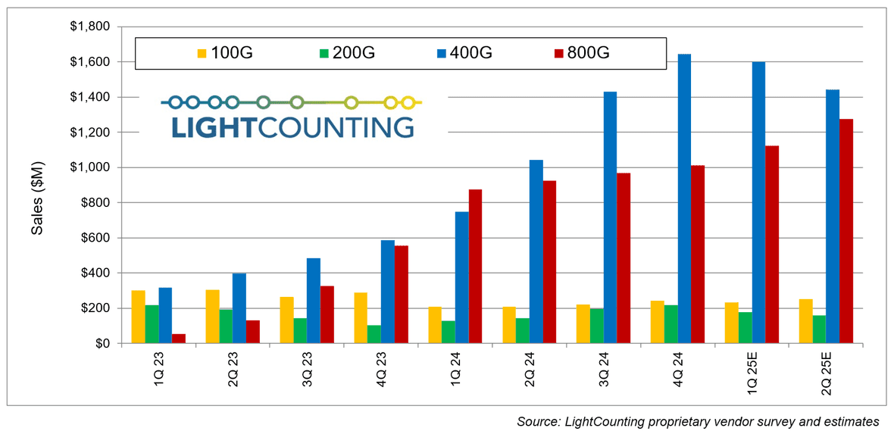
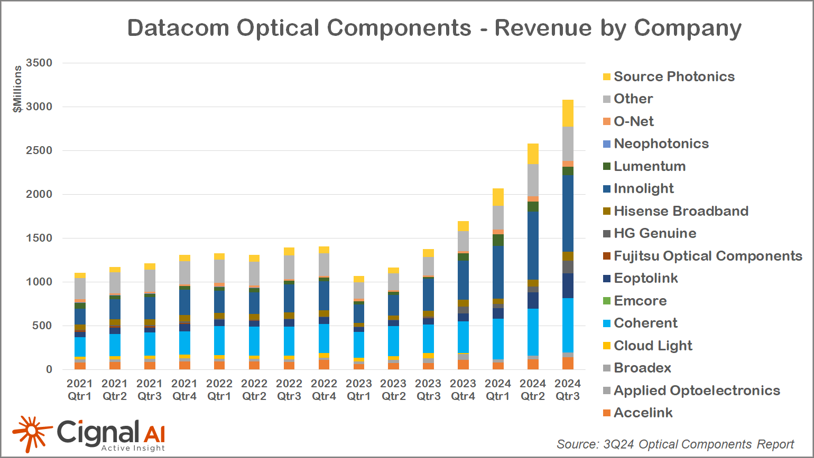
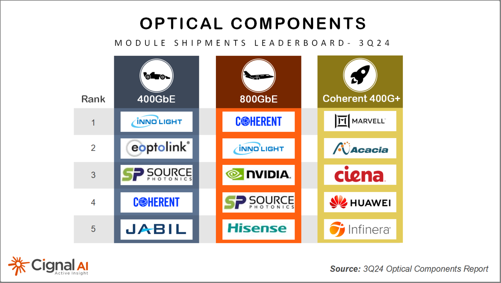
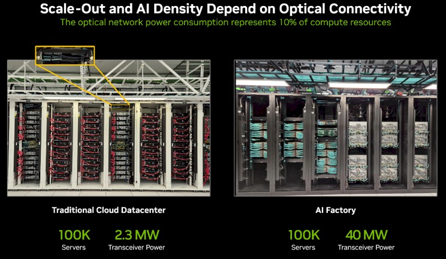
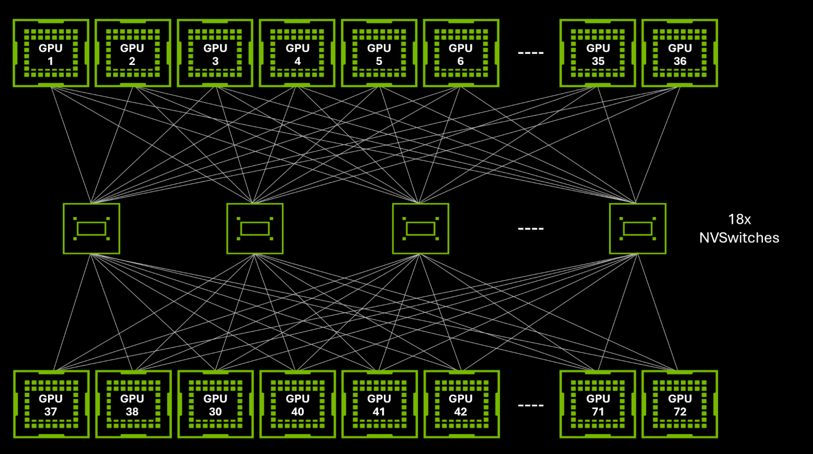
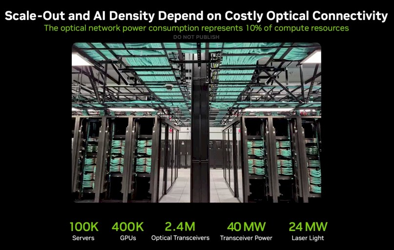



# Optical Transceivers

## Market 

### LightCounting Update

#### 25Q2 update (25/06/12)

Notes
- 400G Ethernet modules declines as Amazon and Meta transition to higher speed
- Sales of 400G and 800G AOCs will also remain strong
- Alphabet, Amazon, Meta, Microsoft, and Oracle (in order) spend more in 25Q1 than 24Q1
- Oracle's spending was up 233%, Q1 reached a record $5.6 billion
- Alibaba plans to invest $53 billion in AI infra over 3 years
- Tencent spent $3.7 billion 25Q1

### 800G market shares

#### [Cignal AI 24/Q3 report (1/7/2025)](https://cignal.ai/2025/01/over-20-million-400g-800g-datacom-optical-module-shipments-expected-for-2024/)

## The transceiver use in datacenter

A comparision between cloud datacenter and AI datacenter from Shainer:

How the numbers might be estimated

|                   | Cloud datacenter | AI datacenter |  Note |
|-------------------|       -----------| ------------ | ---   |
| # of servers      | 72k (73,728)     | 72k (73,728) ||
| # of CPU/server   |      1-2         | 1-2        ||
| # of GPU/server   |        0         | 4          ||
| # of server/rack  | 36     | 18       | NVL72 |
| # of racks        | 2048   | 2048     ||
| scale-out bandwidth/server | 800 Gb/s | 800 Gb/s ||
| # of scale-out switch/rack | 1 | 1 ||
| # of scale-out transceiver/rack  | 72 (36*2) | 72 (36*2) | 800G-link |
| total # of scale-out transceiver | 140K (147,456) | 140K (147,456) | clos topology |
| power /transceiver | 16W  | 16W | 800G-DR OSFP [[e.g. Coherent](https://www.coherent.com/networking/transceivers/datacom/FTCE4517E1PXA)] |
| **total power of scale-out transceivers** | 2.36 MW | 2.36 MW | |
| scale-out bandwidth/server | 0        | 1.8 TB/s (18x800Gb/s) | GB-200 |
| # of scale-up switch (NV switch)/rack | 0 | 18 | GB200 [[ref](https://developer.nvidia.com/blog/nvidia-contributes-nvidia-gb200-nvl72-designs-to-open-compute-project/)] |
| # of scale-up transceiver/rack  | 0 | 1296 (36*18\*2) | 800G-link |
| power /transceiver | 16W  | 16W | 800G-SR LPO [[e.g. ]()] |
| total # of scale-up transceiver | 0 | 2.65M (2,652,208) | full fat-tree topology | 
| **total power of scale-up transceivers** | 0 | 42.5 MW | |

Note:
- NVL72-GB200 NVLink network architecture 

## Reference
- [Semi Vision](https://tspasemiconductor.substack.com/p/vip-report-apr-2025-ofc-nvidia-copper)