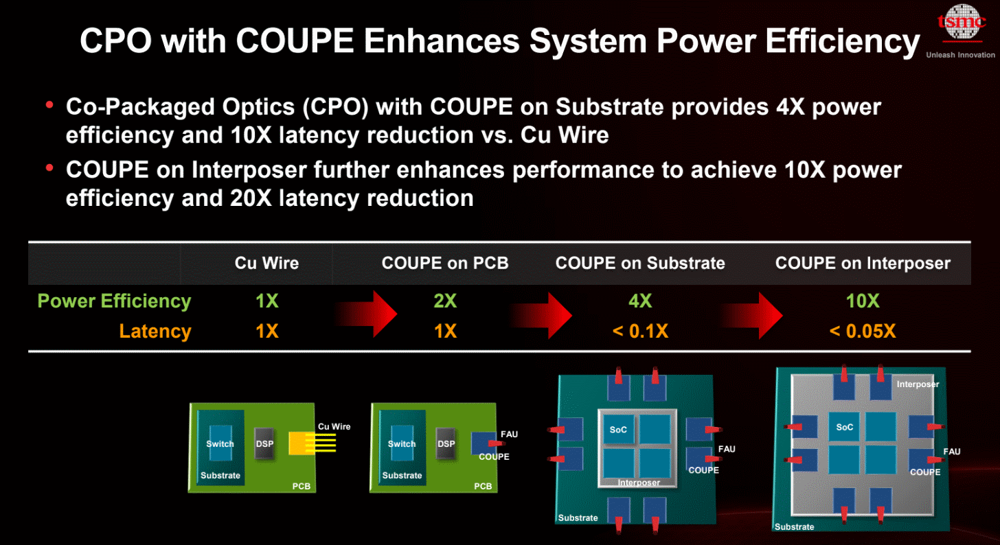



# TSMC PIC Process

## COUPE

COUPE stands for Compact Universal Photonic Engine.

## Roadmap

### 2026 North America Technology Symposium

COUPE Roadmap

### 2025 North America Technology Symposium

3D-IC roadmap for HPC and compact chips for warables [[SemiEngineering](https://semiengineering.com/chip-industry-week-in-review-83/?cmid=418923b0-1c71-4d6a-99ba-f61fc8d599da)]

