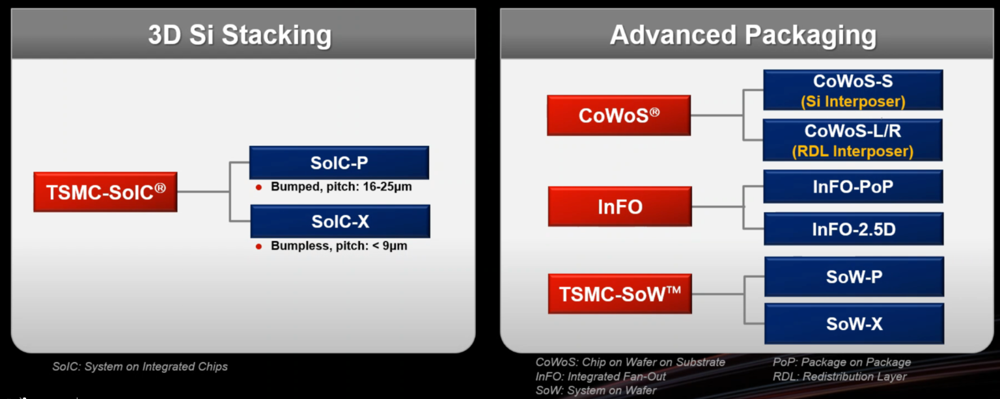



## [License & Citation](index.md#license)

# TSMC Photonic IC

## COUPE

COUPE stands for Compact Universal Photonic Engine.

## 3D integration

### 2025 North America Technology Symposium

3D-IC roadmap for HPC and compact chips for warables [[SemiEngineering](https://semiengineering.com/chip-industry-week-in-review-83/?cmid=418923b0-1c71-4d6a-99ba-f61fc8d599da)]

